# RnD Settlement Hub — R&D 정산 관제 시스템

> 국가 R&D 과제를 수행하는 스타트업이 RCMS 제출 전에 거치는
> **증빙 수집 → 비목 매칭 → 규정 검증 → 대사 → 정산보고서** 과정을 하나로 통합한 내부 시스템.

FastAPI + PostgreSQL + Next.js + Claude API로 만든 AI-Native 업무 자동화 MVP입니다.
집행 건을 제출하면 AI가 증빙을 구조화하고, 15개의 결정론적 룰이 규정 위반을 걸러내며,
국세청 공공 API로 거래처 휴폐업을 검증한 뒤, 사람이 최종 승인합니다.

## 🔗 Live Demo

**https://rnd-settlement-hub.vercel.app**

| 역할 | 계정 | 보이는 것 |
|---|---|---|
| 연구원 | `researcher@demo.kr` | 집행 등록·증빙 첨부·제출 |
| 담당자 | `manager@demo.kr` | 검토·승인/반려·정산보고서·대시보드 |
| 관리자 | `admin@demo.kr` | 위 전부 + 과제·예산 관리 |

비밀번호 공통 `demo1234!` · 무료 서버(Vercel + Render free + Neon)라
**한동안 접속이 없으면 첫 로딩에 30초~1분 — 로그인이 멈춘 듯해도 잠시 기다려 주세요.**
집행 등록을 직접 해보려면 [docs/samples/card-receipt.png](docs/samples/card-receipt.png)를
증빙으로 쓰고 [docs/DEMO.md](docs/DEMO.md)의 입력값 표를 따라 하면 됩니다.

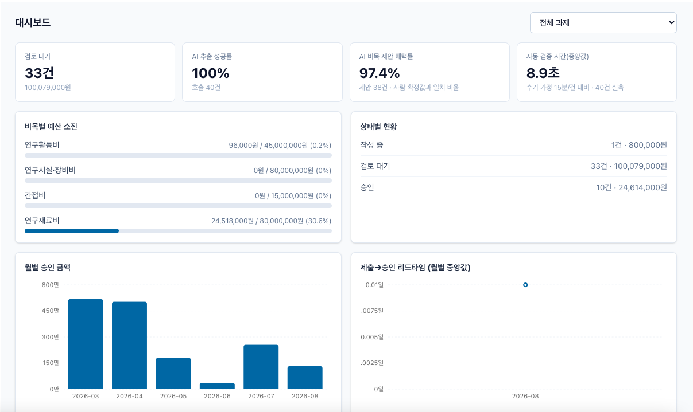

> 대시보드의 "AI 추출 성공률"은 **운영 호출이 실패 없이 완료된 비율**이다(호출 건수 병기).
> 모델이 필드를 **정확히 읽는 비율(88%, 22/25)**은 별도 벤치마크로 잰다 → [docs/AI_EVAL.md](docs/AI_EVAL.md).
> 운영 지표에 합성 평가 트래픽을 섞지 않기 위해 두 숫자를 분리했다.

## 채용공고 주요업무와의 대응

리보틱스 [인턴] AI-Native 풀스택 엔지니어 공고의 업무 범위를 이 프로젝트가 어떻게 다루는지:

| 공고 주요업무 | 이 프로젝트의 구현 |
|---|---|
| 경영지원 업무의 반복 작업 자동화 | 제출 즉시 DB 큐 + 워커가 AI 증빙 추출 → 룰 15종 검증 → 휴폐업 조회를 자동 수행(`backend/app/pipeline.py`). 수기 대조·개별 조회 반복 작업이 파이프라인으로 대체됨 |
| 여러 업무의 데이터를 통합·시각화하는 대시보드 | 집행·예산·검증 결과·AI 호출 이력·처리 시간을 한 화면에 — 비목별 예산 소진, 룰 위반 Top 5, 제출→승인 리드타임, AI 지표, 자동화 Before/After |
| 외부 API 및 공공데이터 연동 | 국세청 사업자등록 상태조회(휴폐업이면 승인 차단 권고 R-VND-002), 한국천문연구원 특일 정보(공휴일 집행 표시 R-DAY-001) — 외부 데이터가 승인 판단에 직접 개입 |
| AI를 활용한 반복 문서 자동 생성 | 월별 정산보고서 — 숫자 집계는 100% SQL 스냅샷, AI는 서술부 초안만 작성하고 담당자가 수정·확정 |
| 이후 RCS·FMS 등 로봇 핵심 시스템으로 확장 | 상태머신 + DB 큐/워커 + 감사 로그 구조는 로봇 작업 이벤트 처리와 동형 — §14 향후 개선사항의 확장 방향 참고 |

## 검증 룰 15종

판정은 AI가 아니라 이 결정론적 룰들이 한다. FAIL은 "차단 권고"이며, 담당자가 사유를
남기면 override 승인이 가능하다(사유는 감사 로그에 기록). 전체 구현은
[`backend/app/rules/catalog.py`](backend/app/rules/catalog.py) 한 파일이고,
**룰별 규정 조항 근거**(혁신법·시행령 별표 2·사용기준 고시·세법)와 "규정 근거 룰 vs
내부 운영 룰"의 구분은 [docs/domain-rules.md](docs/domain-rules.md)에 정리했다.

| 코드 | 심각도 | 검사 내용 |
|---|---|---|
| R-EVD-001 | 위반 | 증빙 파일 미첨부 |
| R-EVD-002 | 위반 | 증빙 금액 ↔ 입력 금액 불일치 (AI 추출값 기반 대사) |
| R-EVD-003 | 주의 | 증빙 발행일 ↔ 집행일 불일치 |
| R-EVD-004 | 위반 | 증빙 사업자번호 ↔ 입력 번호 불일치 |
| R-PRD-001 | 위반 | 연구기간 외 집행 (대표적 전액 환수 사유) |
| R-PRD-002 | 정보 | 협약 종료 30일 이내 집행 (소명 준비 안내) |
| R-BGT-001 | 위반 | 비목 예산 미등록 또는 승인 시 잔액 초과 |
| R-BGT-002 | 주의 | 승인 시 비목 예산 80% 초과 소진 |
| R-VND-001 | 위반/주의 | 사업자번호 체크섬 불일치(국세청 알고리즘) / 미입력 |
| R-VND-002 | 위반/주의 | 폐업·미등록 사업자(위반), 휴업(주의) — 국세청 상태조회 |
| R-VND-003 | 주의 | 사업자 상태 미확인(외부 API 미응답·키 없음) → 수기 확인 요구 |
| R-DUP-001 | 주의 | 동일 과제·거래처·금액·일자 중복 의심 |
| R-DAY-001 | 주의 | 주말·공휴일 집행 |
| R-AI-001 | 주의 | AI 미사용·추출 실패·신뢰도 0.7 미만 → 수기 대조 요구 |
| R-CAT-001 | 주의 | AI 제안 비목 ↔ 선택 비목 불일치 |

## 화면

아래는 전부 **배포된 실제 서비스**(Vercel + Render + Neon)에서 찍은 화면이다.
등록 → 자동 검증 → 담당자 검토 → 반려·재제출 → 승인 → 보고서 → 대시보드 순서로 이어진다.

### 1. 제출 직후 — 검증이 도는 동안

제출하면 상태가 `검증 중`이 되고 작업이 DB 큐에 쌓인다. 워커가 아직 가져가기 전이라
AI 추출값 칸은 "추출 안 됨"이고 검증 결과는 0건이다. **동기 처리가 아니라 큐 기반**이라는
설계가 화면에 그대로 드러나는 순간이다(HTTP 요청은 이미 끝났고 사용자는 기다리지 않는다).

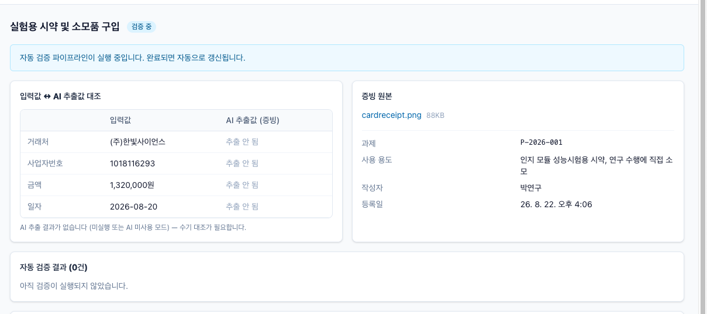

### 2. 검증 완료 — 전 항목 통과

워커가 AI 추출 → 룰 15종 → 국세청 조회를 마치면 화면이 자동 갱신된다.
왼쪽은 **입력값 ↔ AI 추출값 3단 대조**, 아래는 룰별 판정이다. 이 건은 11건 전부 통과다
(15종 중 적용 대상이 아닌 룰은 아예 실행되지 않아 결과에 남지 않는다).

- AI 신뢰도 0.970이 표시된다 — 0.7 미만이면 R-AI-001이 수기 대조를 요구한다.
- AI는 비목을 **제안만** 하고("연구재료비 — 사용 용도가 '연구 수행에 직접 소모되는 재료 구입'으로 명시"),
  확정은 사람이 한다. 판정은 AI가 아니라 룰이 한다.

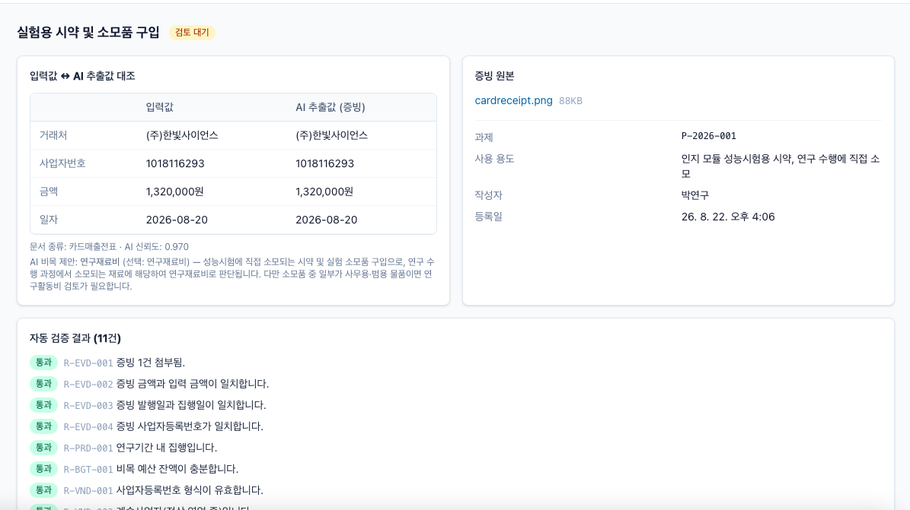

### 3. 담당자 검토 → 승인

연구자 화면에는 없던 `승인`·`반려` 버튼이 담당자 계정에서만 보인다(역할 기반).
위반이 없는 건이므로 사유 없이 바로 승인할 수 있다.

| | |
|---|---|
| 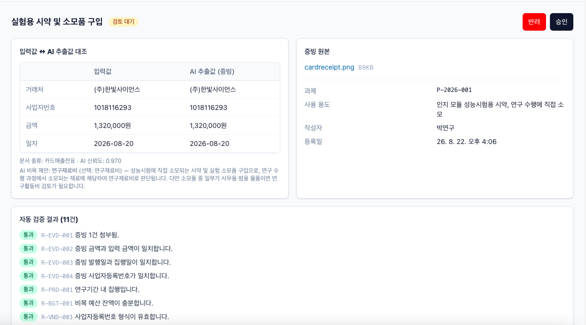 | 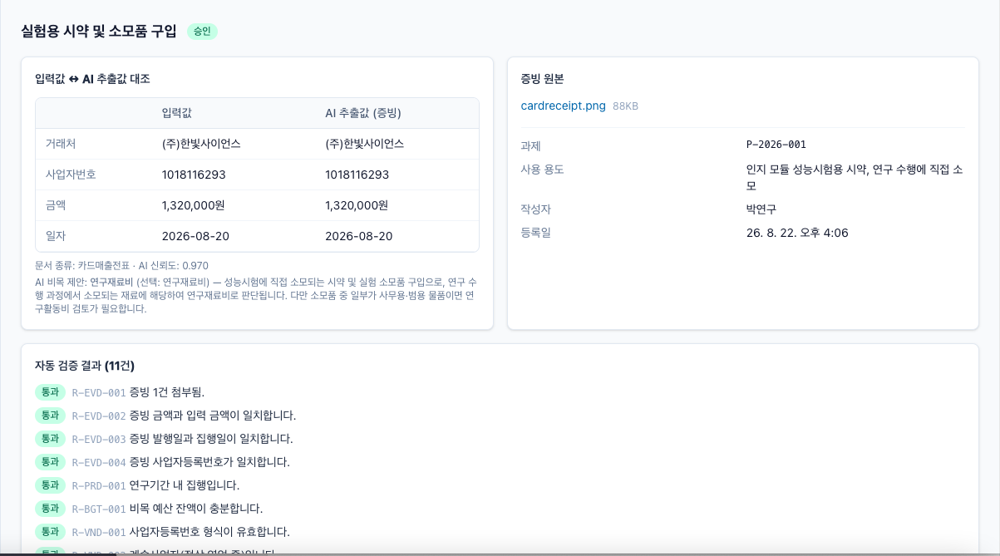 |
| 담당자에게만 보이는 승인·반려 | 승인 완료 |

### 4. 룰이 걸러내는 경우 — 금액 불일치

같은 증빙에 금액만 1,320,000원 → 1,100,000원으로 바꿔 넣으면
**R-EVD-002(증빙 금액 ↔ 입력 금액 불일치)**가 위반으로 뜬다. 다른 10건은 그대로 통과한다 —
룰이 서로 독립적인 순수 함수이기 때문이다.

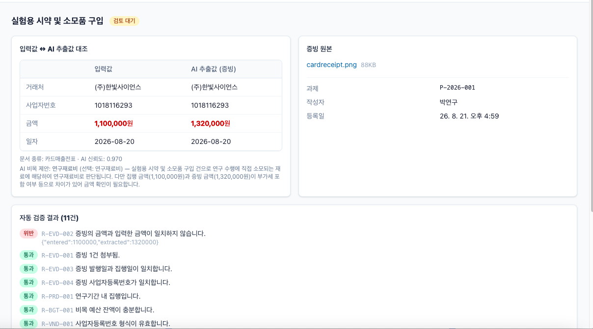

### 5. 반려 — 사유는 선택이 아니라 필수

반려에는 **사유 입력이 강제**된다. 빈 사유로는 확인 버튼이 동작하지 않는다.

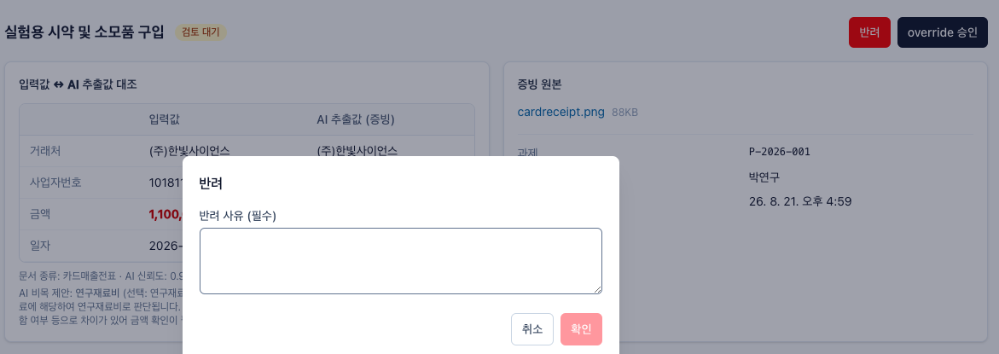

반려 사유는 연구자 화면 최상단 배너로 그대로 전달된다.
"무엇이 왜 반려됐는지"를 다시 물어볼 필요가 없게 만드는 것이 목적이다.

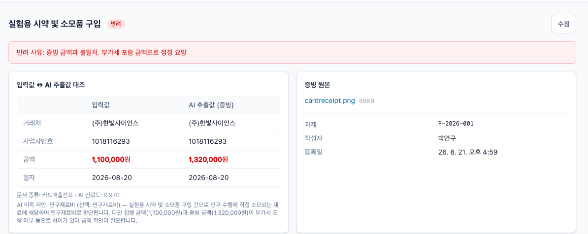

수정하면 상태가 `작성 중`으로 돌아가고, 재제출하면 파이프라인이 처음부터 다시 돈다.

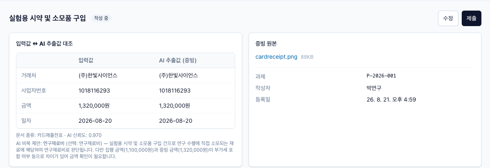

### 6. 위반이 남은 채 승인해야 할 때 — override

규정 예외(예: 종료일 이전 지출원인행위분)는 시스템 밖 정보가 있어야 판단된다.
그래서 FAIL은 **"차단"이 아니라 "차단 권고"**이고, 담당자가 사유를 남기면 승인할 수 있다.
사유는 필수이며 감사 로그에 기록된다 — 화면이 그 사실을 먼저 알린다.

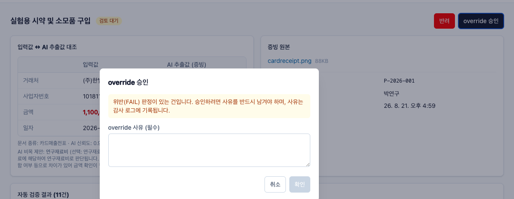

### 7. AI가 잘못 읽어도 걸린다 — 다층 방어

이 건은 AI 추출값(5,082,000원)과 입력값(4,962,000원)이 120,000원 어긋났다.
AI 신뢰도는 0.950으로 높아 **R-AI-001 저신뢰 플래그가 붙지 않는 구간**인데도,
입력값 대조(R-EVD-002)가 독립적으로 잡아냈다. AI를 믿어서가 아니라
"AI는 추출만, 판정은 룰"이라는 분리 때문에 걸린 것이다.

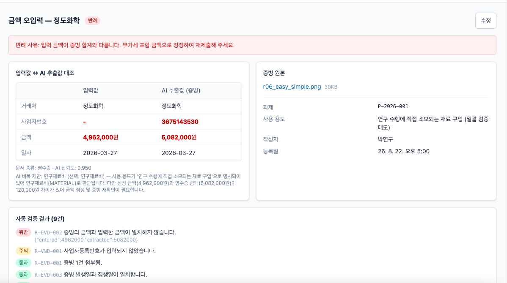

금액을 정정하고 사업자번호까지 채워 재제출하자 3단 대조는 전부 일치했지만,
이번엔 **다른 두 룰**이 걸렸다.

- **R-VND-002(위반)** — 번호를 채우자 국세청 상태조회가 실제로 돌았고 미등록으로 나왔다.
  데모용 합성 증빙의 번호라 실존하지 않는 값이다. 외부 API가 승인 판단에 직접 개입한다는 증거다.
- **R-DUP-001(주의)** — 동일 거래처·금액·일자의 집행 건이 이미 있어 중복 청구 여부 확인을 요구한다.

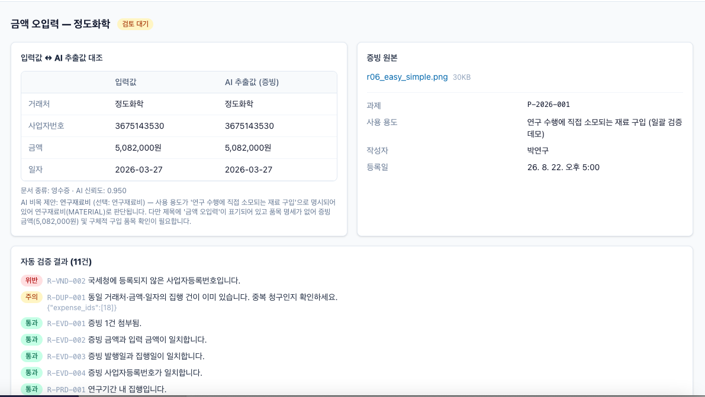

담당자가 사유를 남기고 override 승인하면 그제서야 `승인`이 된다.
**자동 승인은 어떤 경로로도 없다.**

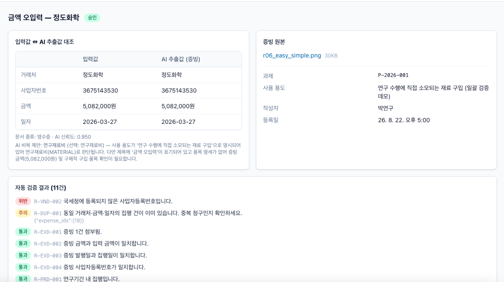

### 8. 목록 — 상태와 리스크가 한눈에

승인·반려·검토 대기가 섞여 있고, 각 건의 리스크(주의/위반)가 함께 표시된다.
담당자는 위반 건부터 처리하면 된다.

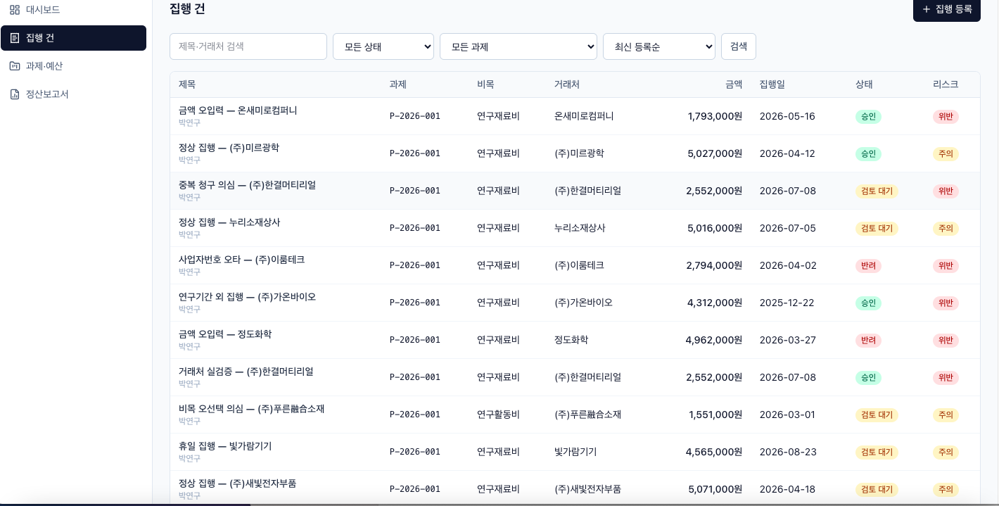

### 9. 월별 정산보고서 — 숫자는 SQL, 서술부만 AI

집계표는 **AI가 만들지 않은 숫자**(SQL 스냅샷)이고, AI는 그 숫자를 바탕으로
서술부 초안만 쓴다. 초안임을 화면이 명시하고, 담당자가 수정·확정한다.
LLM에 금액 계산을 시키지 않는다는 원칙이 화면 구성에 그대로 반영돼 있다.

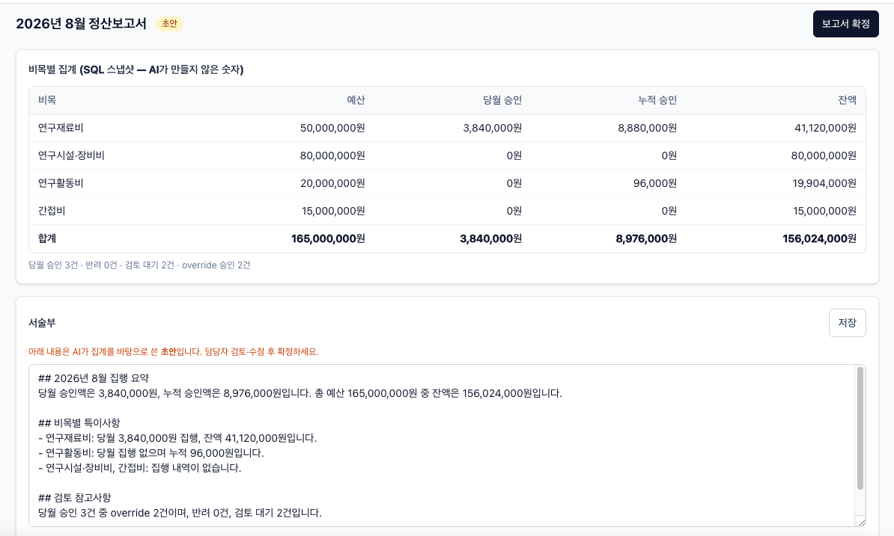

### 10. 대시보드 — 자주 걸리는 룰

어떤 룰이 실제로 많이 걸리는지 집계한다. 이 목록은 "다음에 무엇을 교육·개선할지"를
정하는 데 쓰인다 — 예를 들어 R-DAY-001(휴일 집행)이 상위라면 사전 안내가 필요하다는 신호다.

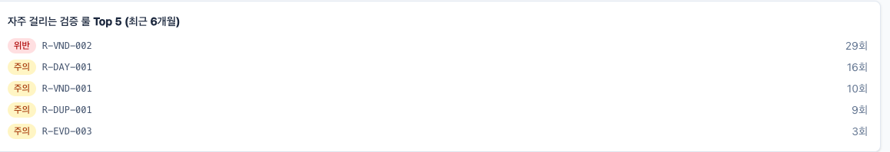

## 1. 문제 정의

국가연구개발사업을 수행하는 기업은 연구비를 RCMS(실시간통합연구비관리시스템)로 집행·보고해야
합니다. 그런데 RCMS는 **제출 채널**이지, 제출 전에 "이 집행이 규정에 맞는지" 검증해 주는
내부 도구가 아닙니다. 실제 현장의 경영지원 담당자는:

- 연구원들이 이메일·메신저로 보내는 증빙(세금계산서·카드전표)을 **엑셀에 손으로 옮기고**
- 어느 비목(연구재료비/연구활동비/…)인지 **감으로 판단**하고
- 연구기간 내 집행인지, 비목 예산이 남았는지, 거래처가 폐업하지 않았는지 **눈으로 대사**합니다

### 왜 필요한가 — 실수의 비용이 비대칭적으로 크다

이 작업의 문제는 "느리다"가 아닙니다. 연구기간 외 집행, 비목 용도 외 사용, 휴폐업 업체와의
거래, 증빙-장부 금액 불일치는 정산 시 **연구비 환수·참여제한 제재**로 이어질 수 있습니다.
규칙은 많고 반복적이며, 대부분 **데이터만 있으면 기계가 먼저 걸러줄 수 있는 것들**입니다.

### 기존 방식(ERP)의 문제

ERP·회계 프로그램은 회계 기준(계정과목) 중심입니다. 국가 R&D 정산은 **과제×비목 중심**이고,
연구기간·비목 잔액·증빙 대사·거래처 상태 같은 **도메인 규칙 검증**과 **검토·승인 워크플로**가
필요합니다. 범용 ERP가 아니라 내부 통제 시스템의 영역입니다.

## 2. 해결 방법

```
집행 등록 + 증빙 첨부 → 제출
  → [자동 파이프라인]  ① AI 증빙 구조화(structured output)
                      ② AI 비목 매칭 제안 (confidence 포함)
                      ③ 룰 엔진 15종 평가 (기간·예산·대사·중복·공휴일…)
                      ④ 국세청 사업자 상태조회 (휴폐업 검증)
  → 담당자 검토 (증빙 원본 ↔ AI 추출값 ↔ 입력값 3단 대조)
  → 승인 / 반려 (FAIL 룰은 사유 있는 override만 허용)
  → 월별 정산보고서 (숫자는 100% SQL, 서술만 AI 초안)
  → 대시보드 · 전 과정 감사 로그
```

**역할 분담이 설계의 핵심입니다** — AI는 비정형 증빙에서 데이터를 꺼내고 분류를 *제안*할 뿐,
**판정은 결정론적 룰 엔진이, 결정은 사람이** 합니다. AI 제안과 인간 확정값은 다른 테이블에
저장되고, 제안 채택률이 대시보드 지표로 상시 감시됩니다.

## 3. 핵심 기능

| 기능 | 설명 |
|---|---|
| 집행 건 워크플로 | 상태머신(DRAFT→…→APPROVED/REJECTED), 검색·필터·정렬·페이지네이션, soft delete |
| 증빙 관리 | 업로드(mime 화이트리스트·10MB), 뷰어, AI 구조화 추출과 3단 대조 화면 |
| 자동 검증 파이프라인 | DB 큐(FOR UPDATE SKIP LOCKED) 기반 워커, 멱등 제출, 재시도·고아 작업 회수 |
| 룰 엔진 15종 | 순수 함수 — 증빙 대사(금액/일자/사업자번호), 연구기간, 예산 잔액, 사업자번호 체크섬, 휴폐업, 중복 의심, 주말·공휴일, AI 신뢰도, 비목 불일치 |
| 승인 통제 | 예산 행 잠금 트랜잭션(동시 승인 예산 초과 차단), FAIL 룰 override 시 사유 강제+감사 기록 |
| 정산보고서 | 비목별 집계는 SQL 스냅샷, AI는 서술 초안만 → 담당자 수정 → 확정 시 포함 건 잠금 |
| 연구비카드 대사 | 카드 사용내역 CSV 업로드 → 집행 건과 결정론적 1:1 대사(일치/근사/수기 확인/대응 없음), 결과는 업로드 시점 스냅샷으로 저장 |
| 대시보드 | 예산 소진·검토 대기·룰 위반 Top·리드타임·AI 지표·자동화 Before/After |
| 인증·권한 | JWT(access) + httpOnly refresh 쿠키(회전), RBAC 3역할 |
| 감사 로그·알림 | 모든 상태 변경·override가 불변 기록, 검토/반려/장애 인앱 알림 |

## 4. 시스템 아키텍처

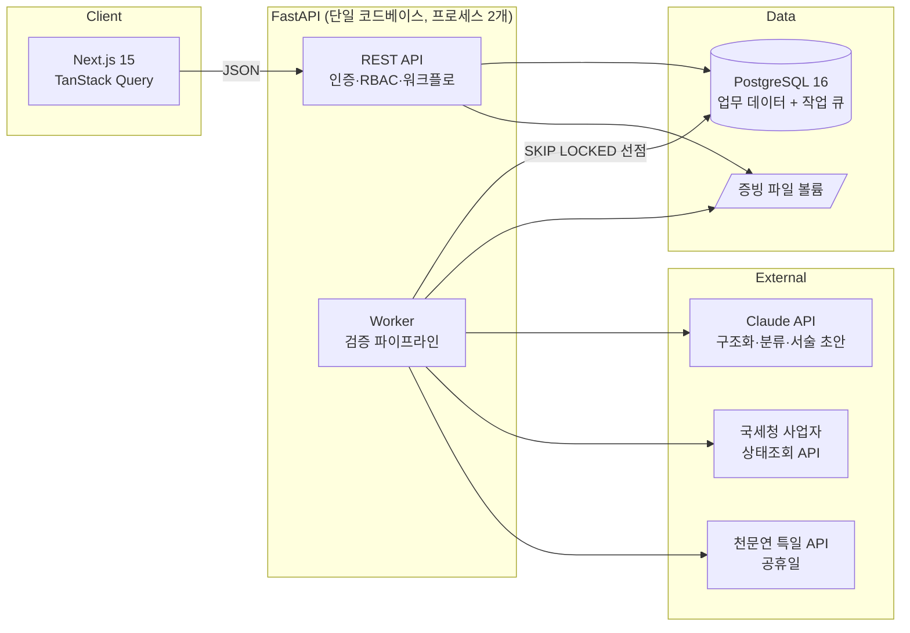

- **작업 큐를 PostgreSQL로 구현**한 이유: 이 규모에서 Redis/Celery는 과잉 인프라이고,
  업무 트랜잭션과 큐 등록이 같은 DB에서 원자적으로 커밋됩니다. 워커 다중 실행 안전성은
  `FOR UPDATE SKIP LOCKED`, 중복 방지는 idempotency key UNIQUE, 장애 복구는 고아
  RUNNING 재큐잉(최대 3회)으로 보장합니다.
- **프론트엔드는 같은 오리진의 `/api/v1`만 호출**하고 Next.js 서버가 백엔드로 프록시합니다.
  배포 환경마다 달라지는 API 주소를 브라우저 번들에 박지 않아도 되고(Codespaces·프리뷰 URL),
  같은 오리진이라 CORS·쿠키 SameSite 문제가 애초에 발생하지 않습니다.
- **외부 의존이 죽어도 워크플로는 멈추지 않습니다**: AI 실패→룰 검증만으로 진행+수기 대조
  플래그, 국세청 API 실패→캐시 폴백 또는 미확인 플래그, 파이프라인 최종 실패→검토 대기로
  전환+담당자 알림.

## 5. 기술 스택

| 영역 | 선택 | 이유 |
|---|---|---|
| Frontend | Next.js 15(App Router)·TypeScript·TanStack Query v5·Tailwind v4·Recharts·react-hook-form+zod | 업무 시스템의 목록/상세/invalidation 패턴, 폼 검증 |
| Backend | FastAPI·Pydantic v2·SQLAlchemy 2.0(sync)·Alembic | 타입 기반 검증, OpenAPI 자동 문서, 명시적 트랜잭션 |
| DB | PostgreSQL 16 | JSONB(AI 결과·감사), native enum, SKIP LOCKED |
| AI | Claude API (`anthropic` SDK, `messages.parse` structured output) | 증빙 이미지/PDF 입력, 스키마 보장 JSON |
| 인프라 | Docker Compose·GitHub Actions·Vercel+Render+Neon | 아래 실행/배포 참고 |

의도적으로 **안 쓴 것**: Redis, Celery, GraphQL, 마이크로서비스 — 문제 대비 과잉이라 뺐고,
언제 다시 필요해지는지는 [한계점](#11-한계점)에 적었습니다.

## 6. 데이터베이스 (ERD)

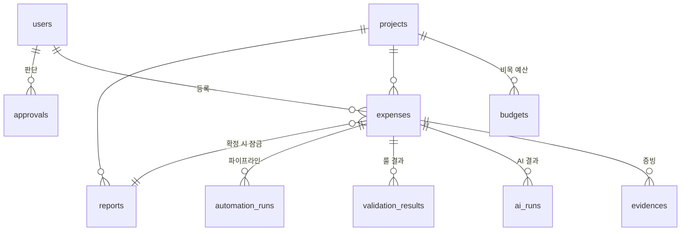

14개 테이블(+공휴일 캐시). 설계 포인트:

- **AI 제안(`ai_runs`)과 인간 확정값(`expenses.category`)의 구조적 분리** — "AI가 틀리면?"의 답
- `automation_runs`가 곧 작업 큐 — idempotency key UNIQUE, 상태·시도 횟수 추적
- 예산 잔액은 비정규화하지 않고 SUM(+복합 인덱스) — 정합성 우선
- 승인 트랜잭션: 집행 건+예산 행 이중 `FOR UPDATE` → 동시 승인으로 예산 초과 불가
  (스레드 2개 race를 재현하는 통합 테스트로 검증)

전체 스키마·마이그레이션: [`backend/app/models/`](backend/app/models), [`backend/alembic/versions/`](backend/alembic/versions)

## 7. API 구조

`/api/v1`, 표준 에러 envelope `{"error":{"code","message","detail"}}`. 전체 명세: [docs/API.md](docs/API.md), 실행 후 `/docs`(Swagger).

```
POST /auth/login·refresh          GET  /dashboard/summary
POST /expenses                    POST /expenses/{id}/submit      ← 파이프라인 트리거(멱등)
GET  /expenses?status=&q=&sort=   POST /expenses/{id}/approve     ← 예산 잠금 트랜잭션
POST /expenses/{id}/evidences     POST /expenses/{id}/reject
GET  /expenses/{id}/history       POST /projects/{id}/reports
POST /reports/{id}/finalize       GET  /notifications
```

## 8. AI 아키텍처

| 호출 | 입력 → 출력 | 실패 시 |
|---|---|---|
| 증빙 구조화 | 이미지/PDF → `{doc_type, vendor_name, biz_no, total_amount, issued_at, confidence}` (Pydantic 스키마 강제) | 룰 검증만으로 진행 + R-AI-001 수기 대조 플래그 |
| 비목 제안 | 집행 정보+추출 결과 → `{category, confidence, rationale}` | 제안 없음, 워크플로 계속 |
| 보고서 서술 초안 | SQL 집계 JSON → 마크다운 초안 | 서술 공란, 담당자 직접 작성 |

hallucination 통제 장치:
- **숫자는 AI가 만들지 않는다** — 보고서 집계는 100% SQL, AI는 "제공된 JSON의 값만 인용" 프롬프트 규칙
- **AI는 판정하지 않는다** — 추출값 vs 입력값 불일치 판정은 룰 엔진(R-EVD-002/003/004)
- confidence 낮음/추출 실패 → 자동 통과 없음, 검토 필수 플래그
- 프롬프트는 코드로 버전 관리(`app/ai/prompts.py`), 모든 호출을 `ai_runs`에 기록(모델·버전·출력·지연)
- **골든 케이스 회귀 테스트**(`pytest -m golden`) — 프롬프트 수정 시 기대 결과 유지 확인
- **AI 제안 채택률**(제안==인간 확정 비율)을 대시보드에 노출해 품질 상시 감시
- **추출 정확도 벤치마크** — 난이도 3단계 합성 영수증 25장(고정 시드 생성, 정답 라벨 포함)에
  실제 모델을 돌려 필드별 정확도·환각·confidence 보정을 측정: [docs/AI_EVAL.md](docs/AI_EVAL.md)
  (`docker compose exec api python -m app.eval_extraction > docs/AI_EVAL.md`로 재측정).
  대시보드의 추출 성공률은 운영 호출 집계이고, 모델 정확도는 이 벤치마크로 잰다 — 두 지표를 섞지 않는다

## 9. 실행 방법

### GitHub Codespaces (설치 없이 브라우저에서)

로컬에 Docker를 설치할 수 없는 환경(예: macOS 12 미만 — Docker Desktop·Colima 모두 미지원)에서는
이 방법이 가장 확실합니다. 저장소 상단 **Code → Codespaces → Create codespace** 클릭 후,
열린 터미널에서 아래 Docker 명령을 그대로 실행하면 됩니다.
포트 3000이 자동 포워딩되어 브라우저에서 바로 열립니다.

### Docker (전체 스택 한 번에)

```bash
cp .env.example .env          # 필요 시 ANTHROPIC_API_KEY, NTS_API_KEY 입력
docker compose up --build     # postgres + api + worker + frontend
docker compose exec api python -m app.seed --demo   # 데모 계정·데이터
# → http://localhost:3000  (manager@demo.kr / demo1234!)
```

### 로컬 개발

```bash
# Backend
cd backend && python -m venv .venv && .venv/bin/pip install -e ".[dev]"
.venv/bin/alembic upgrade head && .venv/bin/python -m app.seed --demo
.venv/bin/uvicorn app.main:app --reload      # 터미널 1: API
.venv/bin/python -m app.worker               # 터미널 2: 워커

# Frontend
cd frontend && npm install && npm run dev    # 터미널 3 → http://localhost:3000
```

### 환경변수

`.env.example`에 전 항목이 정의되어 있습니다. 키가 없어도 동작합니다(성능 저하 모드):

| 변수 | 용도 | 없으면 |
|---|---|---|
| `ANTHROPIC_API_KEY` | Claude API (구조화·제안·서술) | AI 미사용 — 룰 검증만, 수기 대조 플래그 |
| `NTS_API_KEY` | 국세청 사업자 상태조회 ([공공데이터포털 신청](https://www.data.go.kr/data/15081808/openapi.do)) | 사업자 미확인 WARN |
| `KASI_API_KEY` | 공휴일 동기화 ([특일 정보](https://www.data.go.kr/data/15012690/openapi.do)) | 내장 2026 공휴일 시드 사용 |
| `SECRET_KEY` | JWT 서명 | 개발 기본값 (운영에서 필수 교체) |

키가 실제로 적용됐는지는 `GET /health`의 `integrations` 필드로 확인합니다(키 값은 노출되지 않고 설정 여부만 반환).

## 10. 테스트

```bash
cd backend && pytest             # 104 tests: 룰 엔진 단위·API·DB 통합(동시성 race·카드 대사 포함)
cd frontend && npm test          # 7 tests: 유틸·컴포넌트 (Vitest)
bash e2e/run.sh                  # Playwright 4건: 전체 여정 · 반려 재제출 · 목록 상태 유지
ANTHROPIC_API_KEY=... pytest -m golden   # 실 API 프롬프트 회귀 (opt-in)
```

특히 검증에 공들인 지점:
- **승인 동시성**: 스레드 2개가 동시에 승인해도 예산 초과가 불가능함을 실 PG에서 재현
- **큐 신뢰성**: 파이프라인 강제 장애 → 3회 재시도 → FAILED 후에도 집행 건이 검토 대기로
  넘어가 업무가 막히지 않음을 테스트
- **E2E는 AI 키 없이** 돈다 — "AI가 죽어도 완주한다"는 설계 자체가 테스트 대상

CI(GitHub Actions): push/PR마다 backend(ruff·mypy·pytest+PG)·frontend(eslint·tsc·vitest·build), E2E는 수동 트리거.

## 11. 배포

Vercel(FE) + Render(BE, `render.yaml` Blueprint) + Neon(DB). 절차: [docs/DEPLOY.md](docs/DEPLOY.md)

## 12. 성능 / 자동화 효과

과장 없이, 측정 방법과 함께:

- **자동 검증 파이프라인 실측 처리 시간**: 대시보드가 `automation_runs`의 started→finished
  중앙값을 상시 표시합니다. 로컬 E2E 기준 AI 미사용 시 수 초 이내, AI 포함 시 증빙 1건당
  Claude 호출 2회가 지배적입니다(수십 초 수준, 비동기라 사용자는 대기하지 않음).
- **Before(가정)**: 담당자가 집행 1건을 수기 검증(비목 확인·규정 대조·휴폐업 조회·엑셀 기록)
  하는 시간을 **15분/건으로 가정**했습니다. 이 값은 실측이 아니며 코드
  (`ASSUMED_MANUAL_MINUTES_PER_CASE`)와 대시보드에 "가정"으로 명시됩니다.
- 리드타임(제출→승인)·룰 위반 추이·AI 채택률은 축적 데이터 기반으로 대시보드에서 확인합니다.

## 13. 한계점

솔직하게:

- **인건비 참여율 관리 미지원** — 정산 실무의 큰 축이지만 MVP 범위에서 제외 (향후 개선 1순위 후보)
- **증빙 다건 추출** — 현재 대표 증빙 1건만 AI 구조화 (다건 대조는 향후)
- **카드사 API 연동 없음** — 사용내역을 자동으로 가져오지 못해 CSV 내려받기·업로드는 사람이 한다. 업로드 후 대사는 자동이지만, 집행 건에 결제수단 정보가 없어 계좌이체 건이 '카드 미대응' 목록에 섞이는 것도 남은 한계
- **파일 저장이 로컬 볼륨** — 다중 인스턴스 배포 시 S3 교체 필요(`services/storage.py`로 격리해 둠)
- **RCMS 직접 연동 불가** — 공개 API가 없어 제출 자체는 여전히 수동
- 규모 증가 시: 알림 폴링→SSE/웹소켓, 큐 처리량 한계 시 전용 브로커 검토

## 14. 향후 개선사항

1. 연구비카드 사용내역 CSV 업로드 → 등록 집행 건과 자동 대사 (가장 큰 잔여 수작업 제거)
2. 인건비 참여율 관리 (연구자별 참여율 등록·월별 인건비 자동 계상)
3. 증빙 다건 추출·대조, S3 저장 전환
4. 조직 확장: 리보틱스류 산업 현장의 "이벤트 발생→자동 검증→사람 검토→기록→대시보드"
   구조는 도메인 독립적입니다. 집행 건 대신 로봇 운영 이벤트·설비 점검 데이터를 넣어도
   파이프라인·큐·감사 구조가 그대로 동작하도록 설계했습니다.

## 문서

| 문서 | 내용 |
|---|---|
| [docs/DESIGN.md](docs/DESIGN.md) | 설계안 전문 (문제 정의→아키텍처→DB→룰 카탈로그→로드맵) |
| [docs/API.md](docs/API.md) | REST API 명세 |
| [docs/DEPLOY.md](docs/DEPLOY.md) | 클라우드 배포 가이드 |
| [docs/DEMO.md](docs/DEMO.md) | 5분 데모 시나리오 (입력값 표 + 룰별 재현 방법) |
| [docs/samples/](docs/samples/) | 데모용 가상 증빙 이미지와 생성 스크립트 |
| [docs/AI_EVAL.md](docs/AI_EVAL.md) | AI 추출 정확도 벤치마크 결과 (합성 영수증 25장) |
| [docs/domain-rules.md](docs/domain-rules.md) | 검증 룰 15종의 규정 조항 근거 (혁신법·고시·세법) |
