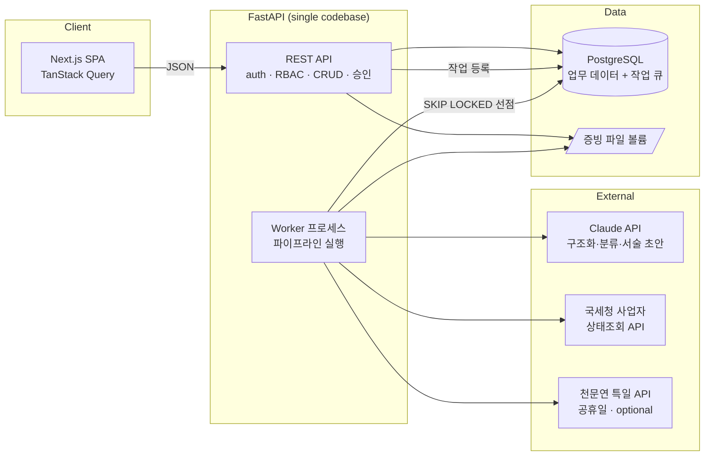
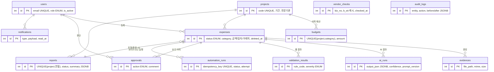

# RnD Settlement Hub — 설계안 v1 (Phase 1–2)

> 리보틱스 [인턴] AI-Native 풀스택 엔지니어 지원용 포트폴리오 프로젝트.
> 이 문서는 구현 착수 전 승인용 설계안이다. 승인 후 Phase 3(DB/API 상세 스펙)부터 구현을 시작한다.

---

## 1. 프로젝트명

**RnD Settlement Hub — R&D 정산 관제 시스템**

국가 R&D 과제를 수행하는 스타트업이 RCMS 제출 전에 거치는
**증빙 수집 → 비목 매칭 → 규정 검증 → 대사 → 정산보고서** 과정을 하나로 통합한 내부 시스템.

## 2. 문제 정의

국가연구개발사업을 수행하는 기업은 연구비를 RCMS(실시간통합연구비관리시스템)로 집행·보고해야 한다.
그런데 RCMS는 **제출·집행 채널**이지, 제출 전에 "이 집행이 규정에 맞는지"를 검증해 주는 내부 도구가 아니다.
실제 현장에서 경영지원 담당자는:

- 연구원들이 이메일·메신저로 보내는 증빙(세금계산서, 카드전표, 거래명세서)을 **엑셀에 손으로 옮기고**,
- 어느 비목(연구재료비/연구활동비/…)에 해당하는지 **감으로 판단**하고,
- 연구기간 내 집행인지, 비목 예산이 남았는지, 거래처가 폐업 상태는 아닌지 **눈으로 대사**하고,
- 월말·정산 시즌에 이를 다시 모아 정산 자료를 만든다.

이 작업의 문제는 단순히 "느리다"가 아니다. **실수의 비용이 비대칭적으로 크다.**
연구기간 외 집행, 비목 용도 외 사용, 휴폐업 업체와의 거래, 증빙-장부 금액 불일치 같은 실수는
정산 시 **연구비 환수·참여제한 제재**로 이어질 수 있다. 사람이 눈으로 잡기엔 규칙이 많고 반복적이며,
규칙 대부분은 **데이터만 있으면 기계가 먼저 걸러줄 수 있는 것들**이다.

**왜 기존 ERP/회계 프로그램으로 안 되는가** — ERP는 회계 기준(계정과목) 중심이다. 국가 R&D 정산은
과제×비목 중심이고, "연구기간", "비목 잔액", "증빙 대사", "거래처 휴폐업" 같은 도메인 규칙 검증과
검토·승인 워크플로가 필요하다. 이것은 범용 ERP가 아니라 내부 통제 시스템의 영역이다.

**왜 AI가 필요한가** — 증빙은 형태가 제각각인 비정형 문서(스캔 이미지, PDF, 사진)다. 여기서
거래처·사업자번호·금액·일자를 꺼내 장부와 대조하는 일은 룰만으로는 불가능하고, 사람이 하기엔 순수 반복이다.
AI는 이 **구조화(추출)와 분류 제안**을 맡고, **판정은 결정론적 룰 엔진과 사람이** 맡는다.

## 3. 사용자

단일 회사 내부 시스템. 역할 3개(RBAC).

| 역할 | 코드 | 하는 일 |
|---|---|---|
| 연구원 | `RESEARCHER` | 집행 건 등록, 증빙 첨부, 제출, 본인 건 조회, 반려 건 수정·재제출 |
| 경영지원 담당자 | `MANAGER` | 검증 결과 검토, 승인/반려, 정산보고서 생성·확정, 전체 건 조회 |
| 관리자·연구책임자 | `ADMIN` | MANAGER 권한 + 과제·비목 예산·사용자 관리, 대시보드 |

## 4. 핵심 시나리오 (하나의 업무 lifecycle)

```
[연구원] 집행 건 등록(거래처, 금액, 일자, 비목 선택) + 증빙 파일 첨부 → 제출
    ↓ (자동)
[파이프라인] ① AI 증빙 구조화: 증빙에서 거래처명·사업자번호·금액·일자 추출 (structured output)
             ② AI 비목 매칭 제안: 비목 분류 + confidence (사용자 선택과 다르면 플래그)
             ③ 룰 엔진 검증: 연구기간·예산 잔액·증빙 대사(추출값 vs 입력값)·중복 의심 등 15개 룰
             ④ 외부 API: 국세청 사업자 상태조회 → 휴폐업 업체 거래 감지
             ⑤ 결과 저장 + 담당자 알림 → 상태: 검토 대기
    ↓
[담당자] 검토 화면: 증빙 원본 vs AI 추출값 vs 입력값 3단 비교 + 룰 검증 결과 → 승인 or 반려(사유)
    ↓
[월말] 정산보고서 생성: 비목별 집계는 100% SQL, 특이사항 서술부만 AI 초안 → 담당자 수정 → 확정(잠금)
    ↓
[관리자] 대시보드: 예산 소진율, 검토 대기, 리스크 룰 Top, 처리 리드타임, AI 제안 채택률
    +  전 과정 audit log 기록
```

면접 5분 데모: 시드 데이터 로그인 → 미리 준비한 샘플 증빙(폐업 업체 세금계산서, 금액 불일치 영수증 등)으로
집행 등록 → 파이프라인이 FAIL/WARN을 잡아내는 것을 보여줌 → 승인 → 보고서 → 대시보드.

## 5. 기능 (MVP 범위)

**포함:**
1. 인증(JWT) + RBAC 3역할
2. 과제·비목 예산 관리 (ADMIN)
3. 집행 건 등록/수정/삭제(soft delete) + 증빙 파일 업로드 — 검색/필터/정렬/페이지네이션
4. 자동 검증 파이프라인 (AI 추출 → 비목 제안 → 룰 15개 → 국세청 API) — DB 큐 기반, 중복 실행 방지
5. 검토·승인·반려 워크플로 + 승인 시 예산 잔액 트랜잭션 보장
6. 월별 정산보고서 (SQL 집계 + AI 서술 초안 + 확정 잠금)
7. 대시보드 (예산·리스크·리드타임·자동화 지표)
8. 인앱 알림, 상태 변경 이력, audit log

**제외 (README 향후 개선사항):** 인건비 참여율 관리, 연구비카드사 내역 CSV 대사, RCMS 직접 연동(공개 API 없음),
PDF 내보내기, 이메일 알림, SSO. — 3개월 1인 MVP 원칙에 따라 자름.

## 6. 기술 스택 (선택 이유 포함)

| 영역 | 선택 | 이유 |
|---|---|---|
| Frontend | Next.js(App Router) + TypeScript | 채용공고 요구. 페이지 라우팅·SSR 없이도 관리자형 SPA에 충분한 표준 |
| 서버 상태 | TanStack Query v5 | 목록/상세/승인 후 invalidation 패턴이 업무 시스템과 정확히 맞음 |
| UI | shadcn/ui + Tailwind | 컴포넌트를 코드로 소유 → 면접에서 설명 가능, 커스텀 용이 |
| 차트 | Recharts | 대시보드 4~5종 차트에 충분, 러닝커브 낮음 |
| 폼 | react-hook-form + zod | 등록 폼 검증. zod 스키마를 API 응답 타입과 공유 |
| Backend | FastAPI + Pydantic v2 | Python 역량 활용. 타입 기반 검증·OpenAPI 자동 문서 |
| ORM/마이그레이션 | SQLAlchemy 2.0 + Alembic | 관계형 모델·트랜잭션 제어 명시적, 마이그레이션 이력 관리 |
| DB | PostgreSQL 16 | 채용공고 요구. JSONB(AI 결과·audit), FOR UPDATE SKIP LOCKED(큐) 활용 |
| AI | Claude API (`anthropic` SDK) | 증빙 이미지/PDF 입력 + structured output. 모델은 env로 설정(`claude-opus-5` 기본) |
| 작업 큐 | **PostgreSQL 기반 자체 큐** (Celery/Redis 미도입) | 인프라 1개 줄이고, 큐 동작(선점·재시도·중복 방지)을 직접 설명 가능. `FOR UPDATE SKIP LOCKED` |
| 배포 | Docker Compose / GitHub Actions / Vercel+Render+Neon | 아래 §15 |

의도적으로 **안 쓰는 것**: Redis(캐시·큐 모두 PG로 충분한 규모), GraphQL, 마이크로서비스, 메시지 브로커.
— 금지 4(과도한 기술 추가) 준수. 규모가 커지면 무엇을 바꿀지는 README 한계점에 명시.

## 7. 시스템 아키텍처



- API 서버와 워커는 **같은 코드베이스, 다른 프로세스**(`uvicorn` / `python -m app.worker`). Docker Compose에서 서비스 2개.
- 파일은 MVP에서 로컬 볼륨 저장(경로 추상화 계층을 둬서 이후 S3 교체 가능).
- 확장 방향(리보틱스 정합): "이벤트 발생 → 자동 파이프라인 → 룰 검증 → 사람 검토 → 기록 → 대시보드" 구조는
  집행 건 대신 로봇 운영 이벤트·설비 데이터를 넣어도 그대로 동작하는 일반형이다. 억지 로봇 기능은 넣지 않는다.

## 8. 데이터베이스 (ERD)



13개 테이블. 핵심 설계 결정:

- **비목 ENUM** (혁신법 연구개발비 사용기준 직접비 기준): `인건비, 학생인건비, 연구시설·장비비, 연구재료비,
  연구활동비, 연구수당, 위탁연구개발비, 국제공동연구개발비, 간접비`. 인건비 계열은 스키마엔 존재하되
  MVP 워크플로(참여율)는 범위 밖 — 예산 테이블에는 잡히므로 대시보드 집계는 가능.
- **AI 결과와 인간 판단 분리**: AI 제안은 `ai_runs`에만 저장. `expenses.category`는 항상 사람이 확정한 값.
  → "AI가 틀리면?"에 대한 구조적 답.
- **`expenses.status` 상태 머신**:
  `DRAFT → SUBMITTED → VALIDATING → NEEDS_REVIEW → APPROVED | REJECTED`, `REJECTED → DRAFT`(재작성),
  APPROVED 건은 보고서 확정 시 `report_id`가 박히며 잠금(수정·반려 불가). 전이는 서비스 레이어 한 곳에서만 수행.
- **승인 트랜잭션**: 단일 트랜잭션에서 해당 `budgets` 행 `SELECT ... FOR UPDATE` → 승인 누적액 재계산 →
  초과 검사 → `expenses` 상태 갱신 → `approvals`·`audit_logs` INSERT. 동시 승인으로 예산이 초과되는 race 차단.
- **`automation_runs` = 작업 큐**: `idempotency_key UNIQUE`(expense_id+trigger)로 중복 등록 차단.
  워커는 `FOR UPDATE SKIP LOCKED`로 선점. `RUNNING`인 채 워커가 죽은 작업은 `started_at` 초과 시
  재큐잉(attempt+1, 최대 3회 후 FAILED+알림). → "작업이 중복 실행되면? 장애가 나면?"에 대한 답.
- **잔액은 비정규화하지 않고 SUM으로 계산** (승인된 집행 합). 정합성 우선, 성능은 인덱스
  `expenses(project_id, category, status)`로 해결. 병목 시 개선 계획을 README에 명시.
- 공통: PK/FK/CHECK(`amount > 0`)/`created_at·updated_at`/금액 `NUMERIC(15,0)`(원화 정수)/soft delete는 `expenses`만.

## 9. REST API

`/api/v1` prefix. 표준 에러 envelope `{"error": {"code", "message", "detail"}}`,
목록 응답 `{"items", "total", "page", "size"}`. OpenAPI 문서 자동 생성(`/docs`).

```
POST   /auth/login                     로그인 (JWT access + refresh httpOnly cookie)
POST   /auth/refresh                   토큰 갱신
GET    /auth/me

GET    /projects                       과제 목록 (+비목별 예산·집행 요약)
POST   /projects                       [ADMIN] 과제 + 비목 예산 등록
GET    /projects/{id}
PATCH  /projects/{id}                  [ADMIN]

POST   /expenses                       집행 건 등록 (DRAFT)
GET    /expenses                       검색·필터(status/category/project/기간/거래처)·정렬·페이지네이션
GET    /expenses/{id}                  상세 (증빙·AI 추출·검증 결과·이력 포함)
PATCH  /expenses/{id}                  DRAFT/REJECTED만 수정 가능
DELETE /expenses/{id}                  soft delete (DRAFT만)
POST   /expenses/{id}/evidences        증빙 업로드 (multipart, mime·크기 제한)
GET    /evidences/{id}/file            증빙 파일 서빙 (권한 검사)
POST   /expenses/{id}/submit           제출 → 파이프라인 큐 등록 (idempotent)
POST   /expenses/{id}/approve          [MANAGER+] 승인 (예산 잠금 트랜잭션)
POST   /expenses/{id}/reject           [MANAGER+] 반려 (사유 필수)
GET    /expenses/{id}/history          approvals + audit + automation_runs 타임라인

POST   /projects/{id}/reports          [MANAGER+] 월별 보고서 생성 (집계+AI 서술 초안, 비동기)
GET    /reports  /reports/{id}
PATCH  /reports/{id}                   서술부 수정
POST   /reports/{id}/finalize          확정 → 포함된 집행 건 잠금

GET    /dashboard/summary?project_id&months
GET    /notifications                  / PATCH /notifications/{id}/read
```

엔드포인트 수를 늘리기 위한 API는 없다. 워크플로 동사(`submit/approve/reject/finalize`)가 상태 머신과 1:1 대응.

## 10. AI 아키텍처

Claude API(`anthropic` Python SDK), 모델은 `AI_MODEL` env(기본 `claude-opus-5`). 호출 3종:

| # | 기능 | 입력 → 출력 | 실패 시 |
|---|---|---|---|
| 1 | **증빙 구조화** | 증빙 이미지/PDF → structured output `{doc_type, vendor_name, biz_no, total_amount, issued_at, 필드별 confidence}` (Pydantic 스키마 검증) | 파이프라인은 룰 검증만으로 계속 진행. `R-AI-001`(추출 불가) WARN 플래그 → 수기 대조 필요 표시 |
| 2 | **비목 매칭 제안** | 추출 결과+집행 정보 → `{suggested_category, rationale, confidence}` | 제안 없음으로 표시. 워크플로는 막히지 않음 |
| 3 | **보고서 서술 초안** | SQL 집계 결과(JSON) → 특이사항·소명 서술 마크다운 초안 | 서술부 공란 + "초안 생성 실패" 표시, 담당자가 직접 작성 |

**hallucination·오판 통제 (설계의 중심):**
- 숫자는 AI가 만들지 않는다 — 보고서 집계는 100% SQL. AI는 이미 계산된 수치를 서술로 옮길 뿐이며 초안임이 UI에 명시된다.
- AI 추출값은 **판정하지 않는다** — "추출값 vs 입력값 불일치" 판정은 결정론적 룰 엔진이 수행. AI는 데이터 공급자.
- 최종 비목은 항상 사람이 확정. AI 제안-확정 일치율(채택률)을 대시보드 지표로 노출 → AI 품질을 계속 감시.
- confidence 낮음/추출 실패 → 자동 통과 없음, 검토 필수 플래그.
- 모든 호출을 `ai_runs`에 기록(모델, prompt_version, 출력 JSON, latency). 프롬프트는 코드로 버전 관리하고
  **골든 케이스**(샘플 증빙 + 기대 추출값)로 프롬프트 변경 시 회귀 테스트.
- 타임아웃·재시도(1회)·에러 유형별 처리(SDK 타입 예외), API 장애 시에도 워크플로는 진행(성능 저하 모드).

## 11. 외부 API 연동

**주 연동 — 국세청 사업자등록정보 진위확인 및 상태조회 서비스** (공공데이터포털, 실스펙 확인 완료):
- `POST https://api.odcloud.kr/api/nts-businessman/v1/status?serviceKey=...`, body `{"b_no": ["1234567890"]}`
- 응답 `b_stt`/`b_stt_cd`(01 계속·02 휴업·03 폐업), `tax_type`, `end_dt`. 호출당 100건, 일 100만 건 제한.
- **업무 의사결정 연결**: 폐업 업체 세금계산서 → `R-VND-002` FAIL → 승인 차단 권고. 실제 환수 사유를 사전 차단.
- 결과는 `vendor_checks`에 캐시(TTL 30일) → 동일 거래처 반복 조회 방지. 타임아웃 5초, 실패 시
  `UNVERIFIED` WARN + 야간 배치 재조회. **외부 API가 죽어도 제출·검토 워크플로는 멈추지 않는다.**
- env: `NTS_API_KEY` (`.env.example`에 정의, 키 발급은 사용자가 진행)

**보조 연동(optional) — 한국천문연구원 특일 정보 API**: 공휴일 조회(`getRestDeInfo`) → 주말·공휴일 집행 WARN 룰.
연 단위 결과를 로컬 테이블에 캐시하므로 API 없이도(내장 공휴일 시드) 룰은 동작. env: `KASI_API_KEY`.

## 12. 자동화 파이프라인 + 검증 룰 카탈로그

제출 1회로 아래가 전부 자동 실행된다 (버튼 여러 번 누르지 않음):

```
submit → automation_runs 큐 등록(idempotent) → 워커 선점(SKIP LOCKED)
  → AI 구조화 → AI 비목 제안 → 룰 15개 평가 → 국세청 조회(캐시 우선)
  → validation_results 저장 → 상태 NEEDS_REVIEW → 담당자 알림 → 대시보드 반영
```

| 코드 | 룰 | 심각도 | 데이터 소스 |
|---|---|---|---|
| R-EVD-001 | 증빙 파일 누락 | FAIL | evidences |
| R-EVD-002 | 증빙 금액 ≠ 입력 금액 | FAIL | AI 추출 vs 입력 |
| R-EVD-003 | 증빙 일자 ≠ 집행 일자 | WARN | AI 추출 vs 입력 |
| R-EVD-004 | 증빙 사업자번호 ≠ 입력 사업자번호 | FAIL | AI 추출 vs 입력 |
| R-PRD-001 | 연구기간 외 집행 | FAIL | projects 기간 |
| R-PRD-002 | 협약 종료 30일 이내 집행 | INFO | projects 기간 |
| R-BGT-001 | 비목 예산 초과(승인 시 재검증) | FAIL | budgets + 승인 누적 |
| R-BGT-002 | 비목 예산 80% 초과 소진 | WARN | budgets + 승인 누적 |
| R-VND-001 | 사업자번호 형식·체크섬 오류 | FAIL | 입력값(체크섬 알고리즘) |
| R-VND-002 | 폐업(FAIL)·휴업(WARN) 업체 거래 | FAIL/WARN | 국세청 API |
| R-VND-003 | 사업자 상태 미확인(API 장애) | WARN | 국세청 API 실패 |
| R-DUP-001 | 중복 집행 의심(과제+거래처+금액+일자 동일) | WARN | expenses |
| R-DAY-001 | 주말·공휴일 집행 | WARN | 공휴일 테이블(특일 API) |
| R-AI-001 | AI 추출 실패·신뢰도 낮음 → 수기 대조 필요 | WARN | ai_runs |
| R-CAT-001 | AI 제안 비목 ≠ 선택 비목 | WARN | ai_runs vs 입력 |

룰은 순수 함수(입력: 집행 건 스냅샷+컨텍스트 → 출력: 결과 목록)로 구현해 단위 테스트를 집중 배치.
FAIL은 승인 차단이 아니라 **차단 권고**(담당자가 사유 입력 후 override 가능 — 현실 업무엔 예외가 있으므로, override는 audit log에 남음).

## 13. 대시보드 (관리자 의사결정용)

| 지표 | 답하는 질문 |
|---|---|
| 과제×비목 예산 vs 승인 집행 vs 잔액 (stacked bar) | 지금 어떤 비목이 위험한가 |
| 상태별 건수·금액 (검토 대기 강조) | 오늘 무엇부터 처리해야 하나 |
| 룰 위반 Top 5 + FAIL/WARN 추이 | 반복되는 실수 유형은 무엇인가 |
| 제출→승인 리드타임 (월별 중앙값) | 처리 속도가 개선되고 있나 |
| AI 추출 성공률·**AI 비목 제안 채택률** | AI를 믿어도 되는 수준인가 |
| Before/After: 건당 수작업 검증 추정시간(가정 명시) vs 파이프라인 실측 처리시간 | 자동화 효과 — 과장 없이 측정 방법 공개 |

## 14. 테스트

- **Backend 단위**: 룰 엔진 15종(경계값 포함), 상태 머신 전이, 예산 계산 — 가장 두껍게
- **Backend API**: httpx AsyncClient로 인증·RBAC·워크플로 엔드포인트
- **DB 통합**: 실제 PostgreSQL(docker)에서 승인 동시성(두 트랜잭션 race → 한쪽만 성공), 큐 선점·재큐잉
- **AI**: `AIClient` 인터페이스 분리 → 테스트는 `FakeAIClient`. 골든 케이스 회귀(실 API 호출은 opt-in 마커)
- **Frontend**: Vitest + Testing Library — 등록 폼 검증, 검토 화면 상태 분기(loading/empty/error)
- **E2E(Playwright) 1본**: 로그인 → 집행 등록 → 증빙 업로드 → 파이프라인(AI mock) → 검토·승인 → 보고서 생성 → 대시보드 확인

## 15. Docker / 배포

- **Docker Compose**: `frontend` / `api` / `worker`(api와 동일 이미지) / `postgres` + 증빙 볼륨. `docker compose up`으로 전체 기동, 시드 스크립트 포함.
- **CI (GitHub Actions)**: backend(ruff+mypy+pytest, PG service container) / frontend(eslint+tsc+vitest+build) / docker build. E2E는 별도 잡(수동/야간).
- **클라우드**: Frontend Vercel, Backend+Worker Render(또는 Railway), DB Neon — 설정 파일과 배포 문서만 작성, 계정·콘솔 작업은 사용자 몫.
- env 분리: `.env.example`에 `DATABASE_URL, SECRET_KEY, ANTHROPIC_API_KEY, AI_MODEL, NTS_API_KEY, KASI_API_KEY, NEXT_PUBLIC_API_URL, UPLOAD_DIR` 정의.

## 16. 개발 로드맵 (약 9주)

| 주차 | Phase | 산출물 |
|---|---|---|
| 1 | P1–P2 확정, 뼈대 | 이 문서 승인, 모노레포 구조, Docker Compose, CI 뼈대 |
| 2 | P3 DB/API | Alembic 마이그레이션 전체, REST 스펙 확정, 인증+RBAC |
| 3–4 | P4 Backend | 집행 CRUD·업로드·상태 머신·룰 엔진·국세청 연동·DB 큐 워커 |
| 5 | P6 AI | 구조화·비목 제안·폴백·ai_runs·골든 케이스 |
| 6–7 | P5 Frontend | 목록/등록/검토 화면, 대시보드, 알림 — 에러·로딩·빈 상태 포함 |
| 8 | P4/P5 마무리 | 보고서 생성·확정, 시드+데모 시나리오 |
| 9 | P7–P9 | 테스트 보강·E2E, 배포 설정, README·문서 완성 (버퍼 포함) |

각 Phase 완료 시 커밋·푸시하고 다음 Phase로 넘어간다.

## 17. 면접관 관점 자가검증 (요약)

- **AI가 틀리면?** → 판정은 룰과 사람. AI 제안은 분리 저장, 채택률로 상시 감시, 낮은 confidence는 자동 통과 없음.
- **AI/외부 API가 죽으면?** → 성능 저하 모드로 워크플로 계속. UNVERIFIED/추출 실패 플래그가 검토를 대신 요구.
- **동시 요청·중복 실행?** → 승인은 예산 행 잠금 트랜잭션, 파이프라인은 idempotency key + SKIP LOCKED + 재큐잉.
- **최대 병목?** → 증빙 AI 처리(외부 API latency). 그래서 비동기 큐로 분리했고, 사용자는 기다리지 않는다.
- **가장 먼저 개선할 것?** → 연구비카드 내역 CSV 대사(수작업이 가장 많이 남는 지점) → 향후 개선사항 1순위로 README에 명시.

## 참고 자료

- 국세청 사업자등록정보 진위확인 및 상태조회: https://www.data.go.kr/data/15081808/openapi.do
- 한국천문연구원 특일 정보: https://www.data.go.kr/data/15012690/openapi.do
- 국가연구개발사업 연구개발비 사용기준(비목 체계): https://www.law.go.kr/행정규칙/국가연구개발사업연구개발비사용기준
